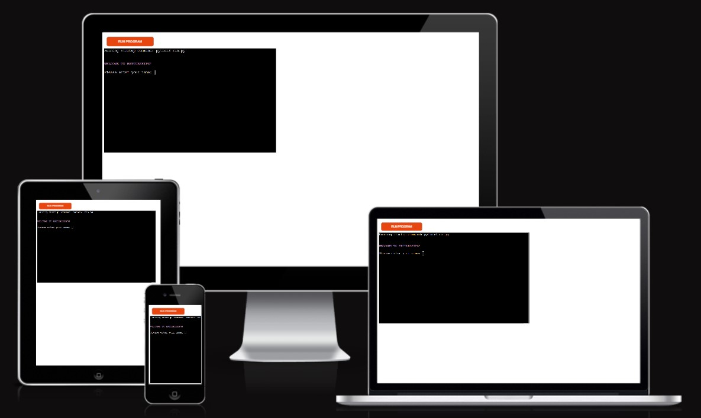
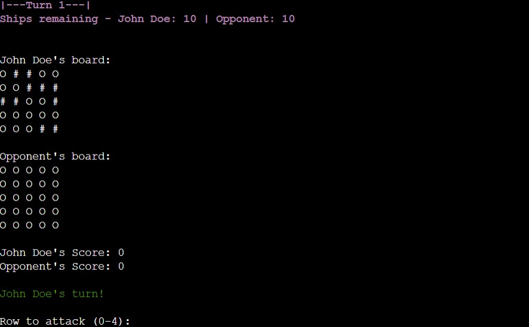
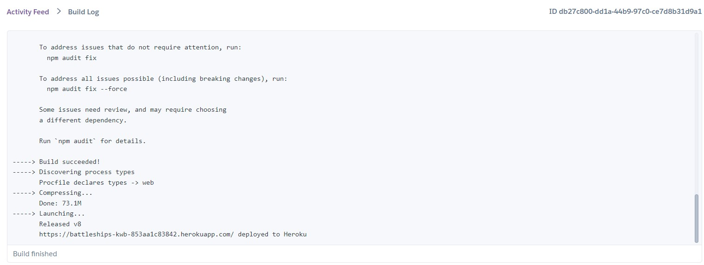
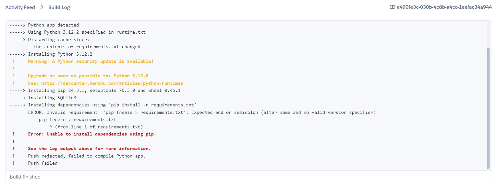

# BATTLESHIPS

Welcome,
BattleShips is a terminal-based Python game where you compete against an opponent to sink their hidden ships on a grid. This game is a fun way to practice Python programming concepts like loops, functions, and random number generation.

Project 3 for the Code Institute. Please visit the live site [here](https://battleships-kwb-853aa1c83842.herokuapp.com/).

Contents:
1. [Introduction](#introduction)
2. [Features](#features)
3. [Testing](#testing)
4. [Deployment](#deployment)
5. [Future](#future)
6. [Credits](#credits) 

## Introduction

### How to play
1. The game is played on a grid where opponent's ships are hidden.
2. Players and the opponent (computer) take turns targeting positions by marking co-ordinates.
3. Points are awarded as follows:
    - Hit ("!"): +3 points
    - Miss ("X"): -1 point
4. The goal is to sink all the opponent's ships before they sink yours.
5. Ships have each other's backs and come in pairs (2 adjacent tiles, horizontally or vertically).
6. You can choose the board size (from 5x5 to 10x10).
7. The number of ships is double the smaller dimension of the board.

### Mock Up
This is how the programme appears on various devices.

## Features

### Welcome screen:
A magenta "Welcome to Battleships" message and a white name entry prompt are the first messages the user sees upon running the program. Once entered, the rules of the game (displayed in magenta) are explained to ensure players understand this variation of Battleships. Next, users are prompted to choose their board size, with the option to select the number of rows and columns independently (5 to 10). The rules advise that smaller boards make the game easier.

### Turns
The turns are highlighted in magenta to maintain consistency with previous messages. The display_boards() function in run.py ensures the turn counter increases with each round. It displays how many ships each player has left, helping users track their progress. The player's board is then printed, followed by the opponent's hidden board.

- "O" represents empty grid spaces.
- "#" represents the player's ships, while the opponent's ships remain hidden.

The scoreboard is displayed, starting at 0 points each. The player always takes the first turn by selecting a target.

After choosing a target, the player is informed whether they hit or missed a ship. The opponent's turn follows, selecting random coordinates that haven't already been targeted. Players are notified of the opponent's results (hit or miss) before moving to the next round.

### End Game
The number of turns in a game is not limited, the only way a winner is declared is by sinking all the opponents ships. When a player wins the game they are greeted with a congratulations message in green and the player's name at the end to make it more personal.

However, if the player cannot sink all the opponent's ships in time, they must be declared the loser. They are then given a message in red stating that they lost the game. Lastly, no matter the outcome, win or lose, players are given their final scores.

## Testing
The code for the Battleships game has been tested using the following validation tools:

### Python Code Validation:

PEP8 Online to ensure the Python code adheres to the PEP 8 style guide.The deployed website showed no major errors or warnings.

Earlier testing of the first versions of the game multiple revealed formatting issues (e.g., line length), prompting more frequent checks. Below is an earlier test result showing warnings before they were actioned:

### Manual Testing

The Battleships game was manually tested in various scenarios to ensure it functions correctly. All code was frequently run in the terminal and any errors were picked up quickly, this also included putting in known invalid inputs to test how the code handled errors. Below are the details of the manual testing conducted:

<strong>Welcome Message and Input Validation:</strong>

- Player enters their name - then the game continues
- Player enters an empty name - prompt is repeated until valid input.
- No restrictions on using non-alphabetic characters in their name.

<strong>Board Size Selection:</strong>

- Enter valid rows and columns, 5 to 10 - board is created and game begins.
- Enter invalid rows and columns - error message promting repeats.
- Enter non-integer input - error message promting repeats.

<strong>Gameplay:</strong>

- Player selects valid target coordinates - hit or miss is registered, score updated.
- Player selects invalid coordinates - error message displayed, prompt repeats.
- Player sinks all opponent ships - victory message displayed, game ends.
- Opponent sinks all player ships - loss message displayed, game ends.

<strong>Scoring System:</strong>

- Player/ opponent hits a ship - +3 points added score.
- Player/ opponent misses - -1 point deducted from score.

## Deployment 
<strong>Heroku Deployment Check:</strong>

Verified the application works as expected after deployment to Heroku: [Click here](https://battleships-kwb-853aa1c83842.herokuapp.com/).

The final version had no errors and was successfully built:

The first attempt at deployment failed as there was no mention of colorama in the requirements.txt file.

## Future
Future versions of this game could include:

- Enhanced AI logic: improved opponent's targeting system so that is focuses on adjacent tiles after a hit. This would make the game morechallenging.
- Custom ship placement: giving the option for players to place their ships in desired co-ordinates.
- More ship variety: like in the original board game, having ships that come in different sizes would increase the difficulty of the game and may introduce more strategic gameplay.
- Powerups: changes up the repetition of the game, it may make it more engaging.
- A graphical interface: to make the game look more polished and eye-catching.

## Credits