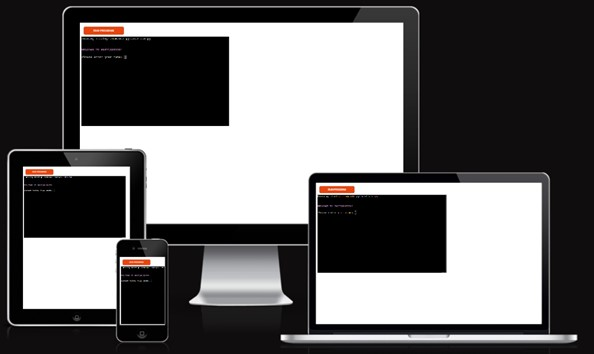
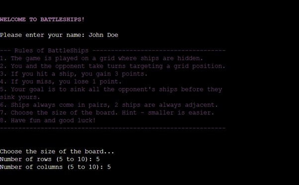
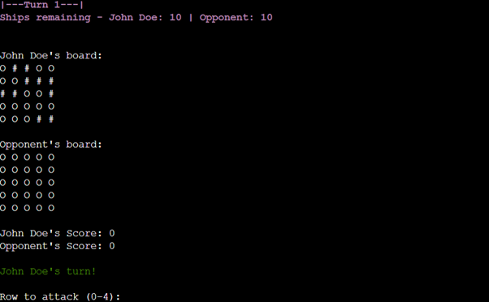
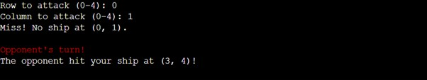
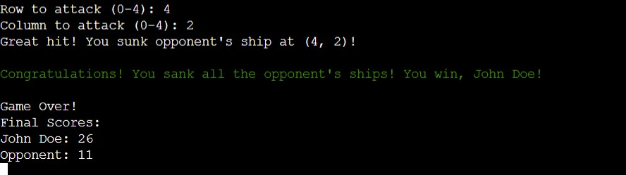
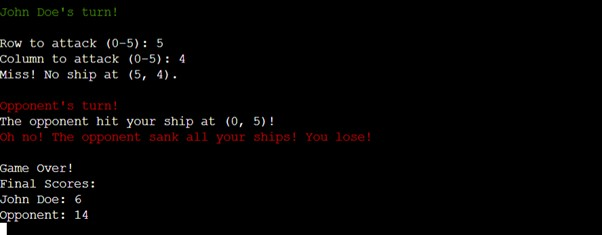
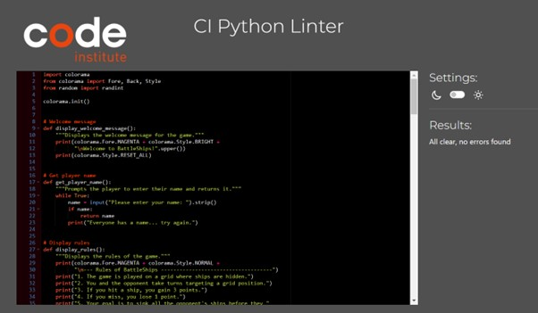
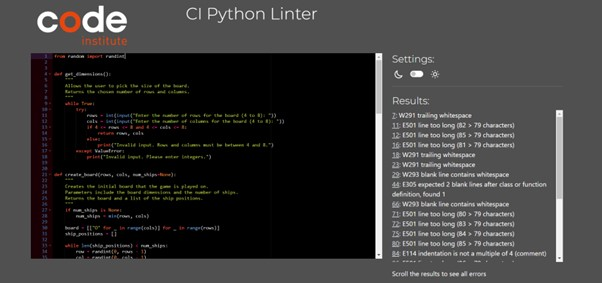

# BATTLESHIPS

Welcome,
BattleShips is a terminal-based Python game where you compete against an opponent to sink their hidden ships on a grid. This game is a fun way to practice Python programming concepts like loops, functions, and random number generation.

Project 3 for the Code Institute. Please visit the live site [here](https://battleships-kwb-853aa1c83842.herokuapp.com/).

Contents:
1. [Introduction](#introduction)
2. [Features](#features)
3. [Testing](#testing)
4. [Deployment](#deployment)
5. [Future](#future)
6. [Credits](#credits) 

## Introduction

### How to play
1. The game is played on a grid where opponent's ships are hidden.
2. Players and the opponent (computer) take turns targeting positions by marking co-ordinates.
3. Points are awarded as follows:
    - Hit ("!"): +3 points
    - Miss ("X"): -1 point
4. The goal is to sink all the opponent's ships before they sink yours.
5. Ships have each other's backs and come in pairs (2 adjacent tiles, horizontally or vertically).
6. You can choose the board size (from 5x5 to 10x10).
7. The number of ships is double the smaller dimension of the board.

### Mock Up
This is how the programme appears on various devices.

## Features

### Welcome screen:
A magenta "welcome to battleships" and a white name entry message are the first messages the user sees as soon as they run the program. Once entered, the rules of the game (also in magenta) are displayed for users to uderstand all the rules to this variation of Battleships. This is then followed by a prompt for users to choose their board size where they can choose the number of rows and columns independently from 5 to 10. In the rules they were advised that the smaller the board, the easier the game.

### Turns
The turns are highlighted in a magenta colour that continues the theme from the previous messages. The function display_boards() in run.py is responsible for the turns increasing by 1 each round. It displays how many ships each player has left on their boards, an easy way for the user to track their progress, followed by the player's board being printed, then the opponent's. "O"'s represent the empty grid spaces, "#" represents the player's ships whilst the opponent's are hidden. The score board is then displayed and starts the game with 0 points each. Finally, the player gets to go first and choose their first target.

Once the player has selected their target row and column, they are told whether they got a hit or a miss. This is immediately followed by the opponet's turn which is automated and selects a random co-ordinate but it cannot be one that's already been selected. Lastly, players are told whether their opponent hit or missed on of their ships before going to the next round.

### End Game
The number of turns in a game is not limited, the only way a winner is declared is by sinking all the opponents ships. When a player wins the game they are greeted with a congratulations message in green and the player's name at the end to make it more personal.

However, if the player cannot sink all the opponent's ships in time, they must be declared the loser. They are then given a message in red stating that they lost the game. Lastly, no matter the outcome, win or lose, players are given their final scores.

## Testing
The code for the Battleships game has been tested using the following validation tools:

<strong>Python Code Validation:</strong>

PEP8 Online to ensure the Python code adheres to the PEP 8 style guide.The deployed website showed no major errors or warnings.

The code was tested in earlier stages to ensure errors were being picked up and then minor formatting adjustments (such as consistent indentation and line length) were implemented. The example image below shows my first testing in a much earlier version of the game code through PEP8 testing. This showed that more frequent checks were needed due to the number of warning messages, mostly from indentation errors.

## Deployment 

## Future

## Credits